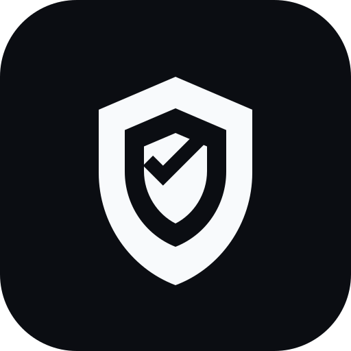
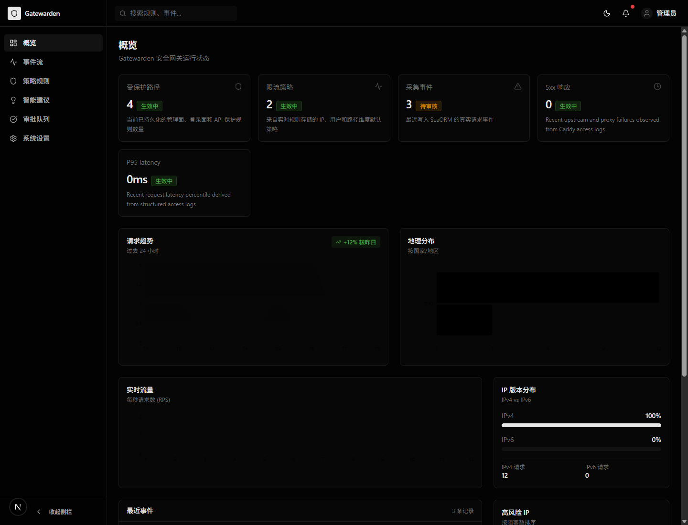
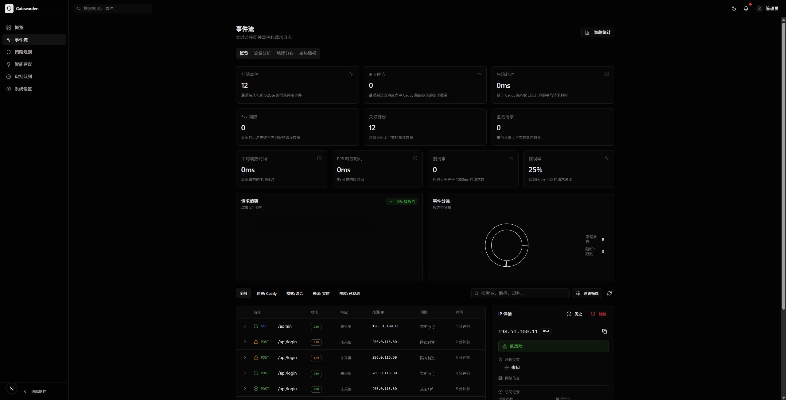
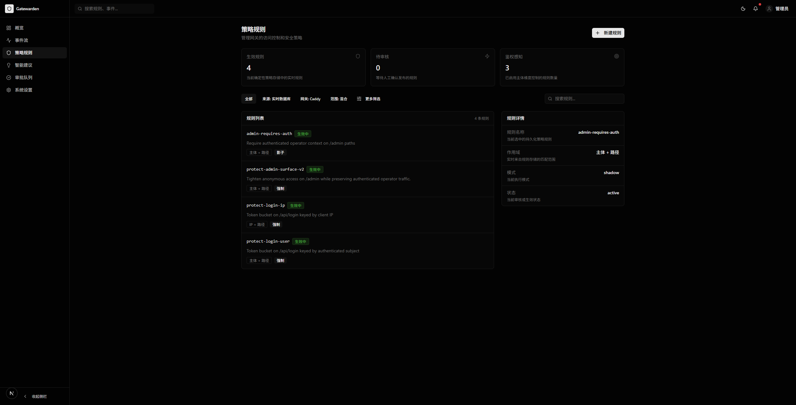

# Gatewarden

[English](README.md) | [简体中文](README.zh-CN.md)

<p align="center">
  
</p>

<p align="center">
  面向自托管应用的开源 AI WAF
</p>

<p align="center">
  
</p>

## 项目简介

Gatewarden 是一个面向自托管应用的开源 AI WAF。

它部署在你的服务前面，接收来自认证层的可信身份头，执行确定性安全策略，并把 AI 放在可审核的建议层，用于规则建议、事件分析和运维协作，而不是直接自动封禁。

## 能力概览

- 通过确定性策略保护管理面与登录面
- 作为 AI 辅助 WAF 保护自托管与内网应用
- 原生适配 `Caddy forward_auth`
- 复用 TinyAuth、oauth2-proxy 或其他 OIDC 前置认证层传来的身份上下文
- 使用 SQLite 持久化事件、规则、审批和设置
- 提供事件、规则、审批、设置、状态码与响应时间的控制台界面
- 保持 AI 只在建议层工作，而不是直接自动阻断请求

## 为什么做 Gatewarden

大多数自托管团队通常已经有：

- 一个反向代理
- 一层身份认证
- 一些脆弱的路径规则
- 分散的访问日志

Gatewarden 的目标是把这些团队需要的关键能力收拢到一个地方：

- 执行基础安全决策
- 回看真实发生了什么
- 审核规则变更
- 在不放弃确定性控制的前提下引入 AI 辅助分析

## 界面截图

### 概览页


### 事件页



### 规则页



## 当前状态

Gatewarden 目前仍处于早期阶段，但已经可以作为本地或单节点的 OSS AI WAF 部署使用。

当前 OSS 范围包括：

- Caddy-first 接入链路
- Trusted header 身份映射
- 基础登录限流
- 管理路径保护
- AI 辅助规则建议与人工审核流
- 概览、事件、规则、建议、审批、设置等控制台页面
- 基于 Caddy access log 的状态码与响应时间观测

当前仍未完成的部分：

- 控制台完整 OIDC 登录
- 多节点同步
- 更完整的企业级审计与协作流程
- 更丰富的 AI 规则建议管道

## 架构结构

主要目录：

- `app/`：Rust HTTP 服务，提供 `forward_auth`、控制台 API、策略执行与日志摄取
- `crates/`：共享 core、网关、策略、限流、Caddy 适配等内部模块
- `web/`：Next.js 控制台前端
- `gatewarden.yaml`：统一运行配置

## 快速开始

### 1. 启动后端

```powershell
cargo run -p gwaf
```

默认地址：

```text
127.0.0.1:4000
```

### 2. 启动前端控制台

```powershell
pnpm install
pnpm --dir web run dev
```

默认地址：

```text
http://127.0.0.1:3010
```

### 3. 验证项目

```powershell
cargo check
cargo test
pnpm --dir web run check
pnpm --dir web run build
```

## Caddy 接入示例

Gatewarden 适合部署在真实认证层之后，作为一层 AI 辅助、但执行仍然确定性的 WAF。

```caddy
app.example.com {
	forward_auth http://127.0.0.1:4000 {
		uri /api/forward-auth
		copy_headers Remote-User Remote-Email Remote-Groups X-Auth-Provider X-Authenticated X-Request-Id
	}

	reverse_proxy http://127.0.0.1:8080 {
		header_up X-Real-IP {remote_host}
		header_up X-Forwarded-For {remote_host}
		header_up X-Forwarded-Proto {scheme}
		header_up X-Forwarded-Host {host}
		header_up X-Forwarded-Uri {uri}
	}
}
```

如果希望在控制台里看到状态码与响应时间，请开启结构化的 Caddy access log，并在 `gatewarden.yaml` 中把日志路径指给 Gatewarden。

## 配置项

项目使用：

```text
gatewarden.yaml
```

关键字段：

- `server.listen_addr`
- `database.url`
- `identity.trusted_headers.*`
- `security.admin_shadow_prefixes`
- `security.login_ip_limit.*`
- `security.login_user_limit.*`
- `security.console_admin_groups`
- `observability.caddy_access_log.*`

## AI WAF 模型

Gatewarden 坚持以下几个原则：

- `Caddy-first`
- `deterministic enforcement`
- `trusted identity headers`
- `AI advisory only`

这意味着：

- 身份上下文应来自可信的上游认证层
- 阻断与限流保持确定性且可审计
- AI 建议必须先可审核，才能进入生效策略

## 开源与商业授权

这个仓库是 Gatewarden 的 OSS 主线仓库。

- 许可证：`AGPL-3.0-only`
- 开源仓库：`gatewarden`
- 商业增强：private `gatewarden-enterprise`

如果你需要闭源部署、OEM/白标、商业支持或企业专属功能，请查看 [COMMERCIAL.md](COMMERCIAL.md)。

## 相关文档

- [README.md](README.md)
- [CONTRIBUTING.md](CONTRIBUTING.md)
- [SECURITY.md](SECURITY.md)
- [COMMERCIAL.md](COMMERCIAL.md)

## 品牌资源

仓库内包含：

- 可复用的项目 logo，可用于 GitHub、文档和产品界面
- 用于前端控制台的应用图标
- 当前 OSS 控制台的真实截图
